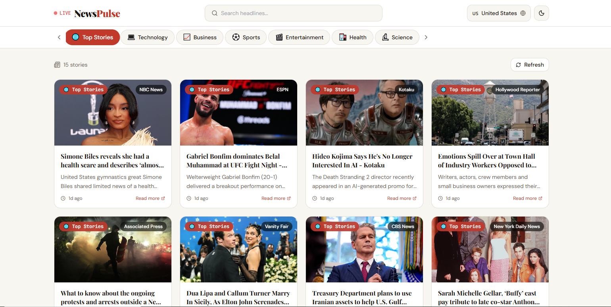

# 📰 NewsPulse

A modern, fully responsive **Live News Web App** built with React.js, Vite, and Tailwind CSS. Browse real-time headlines from around the world filter by category, switch countries, search stories, and read full articles with a beautiful dark/light theme.


---

## ✨ Features

- 🌍 **Multi-Country News**  Browse news from 10+ countries including Pakistan 🇵🇰, USA 🇺🇸, UK 🇬🇧, India 🇮🇳, UAE 🇦🇪 and more
- 🗂️ **7 Categories**  Top Stories, Technology, Business, Sports, Entertainment, Health, Science
- 🔍 **Live Search**  Search any topic or keyword across all news sources
- 🌙 **Dark / Light Theme**  Smooth toggle with full theme support
- 📄 **Full Article Modal**  Click any news card to read title, description & full content
- 📋 **Copy**  Copy full article text to clipboard in one click
- 🔗 **Share**  Native share (mobile) or copy link to clipboard
- ⬇️ **Download**  Save any article as a `.txt` file
- ⚡ **Skeleton Loaders**  Smooth loading experience
- 📱 **Fully Responsive**  Works perfectly on mobile, tablet, and desktop
- 🔄 **Load More**  Paginated news loading

---

## 🛠️ Tech Stack

| Technology | Usage |
|---|---|
| **React.js 18** | UI Components & State Management |
| **Vite** | Fast build tool & dev server |
| **Tailwind CSS v3** | Utility-first styling |
| **Lucide React** | Icon library |
| **NewsAPI** | Live news data source |
| **CSS Variables** | Dark/Light theme system |

---

## 📸 Screenshots

| Light Mode | Dark Mode |
|---|---|
|  |  |

---

## 🚀 Getting Started

### Prerequisites

- Node.js v18+
- npm or yarn
- Free API key from [newsapi.org](https://newsapi.org)

### Installation

```bash
# 1. Clone the repository
git clone https://github.com/your-username/newspulse.git

# 2. Go into the project folder
cd newspulse

# 3. Install dependencies
npm install

# 4. Create environment file
cp .env.example .env
```

### Add your API Key

Create a `.env` file in the root folder:

```env
VITE_NEWS_API_KEY=your_api_key_here
```

Then update `src/utils/newsService.js` line 3:

```js
const API_KEY = import.meta.env.VITE_NEWS_API_KEY;
```

### Run the app

```bash
npm run dev
```

Open [http://localhost:5173](http://localhost:5173) in your browser.

---

## 📁 Project Structure

```
newspulse/
├── public/
├── src/
│   ├── components/
│   │   ├── Header.jsx        # Navbar with search, country, theme toggle
│   │   ├── CategoryBar.jsx   # Category filter tabs
│   │   ├── NewsCard.jsx      # Individual news card
│   │   ├── NewsModal.jsx     # Full article modal with copy/share/download
│   │   ├── SkeletonCard.jsx  # Loading placeholder
│   │   └── Toast.jsx         # Notification system
│   ├── utils/
│   │   └── newsService.js    # API calls & data helpers
│   ├── App.jsx               # Main app component
│   ├── main.jsx
│   └── index.css             # Global styles & CSS variables
├── .env.example
├── tailwind.config.js
├── vite.config.js
└── package.json
```

---

## 🌐 API Information

This project uses the **[NewsAPI](https://newsapi.org)**  a free REST API for news data.

| Plan | Requests/Day | Countries | Hosting |
|---|---|---|---|
| Free (Developer) | 100 | Limited | Localhost only |
| Paid | Unlimited | All | Production ready |

> **Note:** The free plan works on `localhost` only. For production deployment, a paid plan or alternative API is required. Demo mode (mock data) is available without any API key.

### Country Support

| Country | Endpoint Used |
|---|---|
| US, UK, India, Australia, Canada, Germany, France | `/top-headlines` (native support) |
| Pakistan 🇵🇰, UAE 🇦🇪, Saudi Arabia 🇸🇦 | `/everything` (keyword-based search) |

---

## 🔧 Build for Production

```bash
npm run build
```

Output will be in the `dist/` folder.

---

## 🚢 Deployment

### Deploy on Vercel (Recommended)

1. Push your code to GitHub
2. Go to [vercel.com](https://vercel.com) and import your repo
3. Add environment variable: `VITE_NEWS_API_KEY = your_key`
4. Click **Deploy**

### Deploy on Netlify

1. Run `npm run build`
2. Drag & drop the `dist/` folder on [netlify.com/drop](https://app.netlify.com/drop)

---

## 👩‍💻 Author

**Amna Irfan**
- 💼 Fiverr: [aman_ch1](https://www.fiverr.com/aman_ch1)
- 📸 Instagram: [@your_handle](https://instagram.com)
- 🐙 GitHub: [@your-username](https://github.com)

---

## 📄 License

This project is open source and available under the [MIT License](LICENSE).

---

> ⭐ If you found this project helpful, please give it a star on GitHub!
